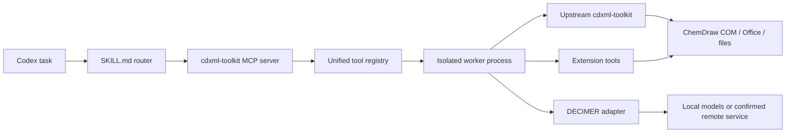

# Architecture

## Repository Boundary

`skill/chemdraw/` is the deployable Codex Skill. Repository documentation, CI, contribution policy, and installation tooling remain outside that directory so they do not enter the Skill context window.

## Progressive Disclosure

The Skill uses five layers:

1. `SKILL.md` frontmatter for trigger metadata.
2. Core rules and task routing in `SKILL.md` and `references/workflow-router.md`.
3. Workflow/domain references for selection, decisions, and failures.
4. Generated exact signatures in `references/mcp-signatures.md`.
5. Generated inventory shards for audits only.

Each fact has one authoritative location. Handwritten references explain decisions and failure behavior; generated files describe callable signatures and upstream inventory.

## MCP Runtime

The registry combines selected upstream tools, reviewed overrides, extension workflows, and the remote DECIMER adapter. Name collisions fail closed. Each call crosses a worker boundary so a hung tool can be terminated without blocking the MCP server indefinitely.

## File Safety

Modifying tools preflight inputs and destinations, stage outputs, validate format/content, and publish only after successful checks. Source files remain unchanged unless a legacy upstream contract explicitly requires otherwise. Extension tools use `{ok, outputs, warnings, metadata}`.

## Privacy Boundary

Local parsing and ChemDraw COM remain on the host. Remote DECIMER is a separate trust boundary: HTTPS alone is insufficient, and upload requires explicit confirmation plus origin validation. See [privacy and safety](privacy-and-safety.md).

## Generated Documentation

- `generate_tool_reference.py` builds exact MCP signatures from the unified registry.
- `audit_toolkit_interfaces.py` scans the installed toolkit and writes a small index plus domain shards.
- Curated references map inventory modules to preferred entry points, failure modes, supporting APIs, and exclusions.
