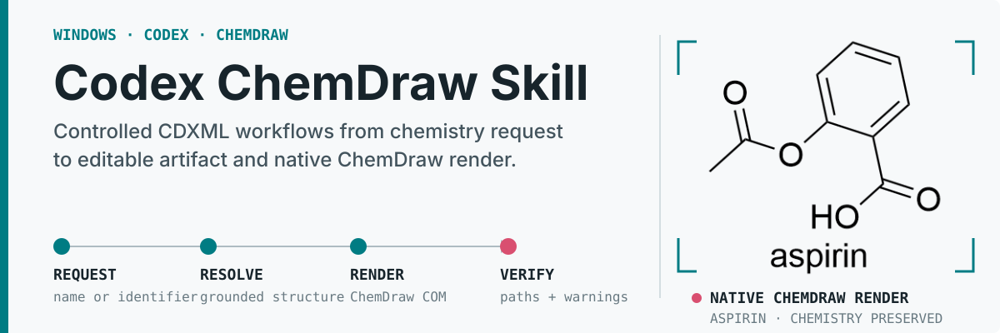

# Codex ChemDraw Skill 中文指南

<p align="center">
  
</p>

<p align="center">
  <a href="../README.md"></a>&nbsp;
  <a href="#从零开始安装"></a>&nbsp;
  <a href="../skill/chemdraw/references/workflow-router.md"></a>&nbsp;
  <a href="../.github/SECURITY.md"></a>
</p>

<p align="center">
  <a href="https://github.com/ZiChenWang114514/codex-chemdraw-skill/actions/workflows/validate.yml"></a>&nbsp;
  &nbsp;
  &nbsp;
  &nbsp;
  <a href="../LICENSE"></a>
</p>

这是一个使用 `cdxml-toolkit-community` 的 Codex Skill 与 MCP 服务，可完成结构绘制、反应式处理、格式转换、候选结构识别、Office 嵌入和部分实验数据工作流。可移植核心支持 Windows、macOS 和 Linux；ChemDraw、ChemScript 与 Office 原生功能需要 Windows 主机。项目支持 Python 3.10 至 3.13，托管 CI 使用 Python 3.12 验证 MCP Python SDK 1.x 和 2.x。

本项目是独立社区项目，与 Revvity、OpenAI、Microsoft 以及上游 `cdxml-toolkit`、MCP Python SDK、RDKit、DECIMER 的维护者没有隶属或背书关系。

## 从请求到可核验产物

```text
化学请求
    -> 解析并核验结构身份
    -> 创建、比较或修改 CDXML
    -> 需要时使用 ChemDraw 原生渲染
    -> 返回绝对路径、化学元数据与警告
```

每次任务应返回可编辑 CDXML，以及请求所需且本机软件支持的 ChemDraw、Office 或分析产物。原生渲染可以确认文件能被 ChemDraw 正确处理，但不能单独证明分子身份；科研使用前仍需与可信来源核验。

## 主要功能

- 根据名称、SMILES、InChI 等标识解析并绘制结构。
- 使用 ChemScript 结构标识和 RDKit 指纹比较单个分子或有限批次。
- 清理、合并、润色、拆分和渲染 CDXML 反应式。
- 使用本地 DECIMER，或在明确确认后调用远程服务，提取候选结构、置信度和包围框；候选结果仍需核验。
- 在支持的 Windows 环境中将 CDXML 嵌入 PowerPoint 和 Word。
- 处理选定的 LCMS、SciFinder RDF 和实验记录工作流。
- 查询本机 ChemScript SDK 的公开接口目录，并在独立工作进程中执行受支持的声明式调用。进程隔离可限制超时调用造成的影响，但不提供操作系统级沙箱。
- 可选用 Streamable HTTP 向另一台电脑提供服务，并提供健康状态和 Prometheus 指标。非本机监听必须配置 Bearer Token、允许的 `Host` 和加密网络。

项目审计清单记录了 584 个 `cdxml-toolkit-community` 公开符号，这个数字表示工具包接口清单，并非 Codex MCP 配置中的 35 个工具。ChemScript 公共目录可被发现和报告，也不表示每个成员都能在所有 SDK 版本、许可证和位数组合中成功执行。

## 先判断需要哪些组件

不同功能需要的软件并不相同。第一次安装前，请先按自己的使用目标查看下表。

| 使用目标 | 需要安装的组件 |
| --- | --- |
| 解析名称、读取或生成 CDXML、绘制普通结构 | Windows、macOS 或 Linux，Codex、Python 环境、`cdxml-toolkit-community`、MCP SDK |
| 使用 ChemDraw 原生渲染、CDX 转换、结构清理 | 上述组件，加 Windows 桌面版 ChemDraw、有效许可证和 COM 注册 |
| 比较分子、调用 ChemScript SDK | 上述组件，加 ChemScript DLL；某些旧版本还需要独立的 32 位辅助 Python |
| 在 DOCX 或 PPTX 中插入可编辑 ChemDraw 对象 | 上述组件，加对应的 Word 或 PowerPoint 桌面应用 |
| 在本机识别化学结构图片 | 上述组件，加 DECIMER 模型权重；需要更多内存、磁盘和首次下载时间 |
| 让另一台电脑调用这台 ChemDraw 工作站 | 服务器端完成上述安装，再配置带令牌的 Streamable HTTP 和加密网络 |

只使用普通 CDXML 工具时，可以暂时不安装 ChemDraw、Office、ChemScript 辅助环境或 DECIMER 模型；运行前提检查时使用 `-Capabilities core`。需要原生渲染、CDX、ChemScript 或可编辑 Office 对象时，再安装对应桌面软件并选择相应能力。

## 安装前提

### 电脑和系统

- 可移植 CDXML 和 RDKit 功能支持 Windows、macOS 与 Linux。ChemDraw COM 自动化不能在 macOS、Linux 或 WSL 中直接运行；原生功能需要 64 位 Windows 10 或 Windows 11。
- 建议至少 8 GB 内存和 10 GB 可用磁盘。使用本地 DECIMER 时，建议 16 GB 内存并预留更多空间。
- 首次安装需要联网下载项目、Python 包和可选模型。学校或单位网络如使用代理，应按本单位要求配置 Conda、pip 和 Git。
- 使用 ChemDraw 原生功能时必须持有合法许可证。项目不会安装、激活或修改 ChemDraw 许可证。
- [Revvity 当前系统要求](https://support.revvitysignals.com/hc/en-us/articles/43424307511572-ChemDraw-What-are-the-System-requirements-for-ChemDraw-ChemOffice)列出的 ChemDraw 22.0 及更新版本使用 64 位 Windows，并要求 .NET Framework 4.8。项目当前实测 ChemDraw 22.0。

### 基础软件与按功能要求

| 软件 | 用途 | 安装成功的判断方法 |
| --- | --- | --- |
| Windows PowerShell 5.1 或 PowerShell 7 | 执行检查和安装脚本 | `$PSVersionTable.PSVersion` 能显示 5.1 或更高版本 |
| [Codex](https://developers.openai.com/codex/cli) | 读取 Skill 并调用 MCP 工具 | `codex --version` 能显示版本；第一次运行 `codex` 后已完成登录 |
| [64 位 Miniconda](https://docs.conda.io/projects/conda/en/stable/user-guide/install/windows.html) 或兼容 Python 管理器 | 建立独立 Python 环境 | `conda --version` 能显示版本 |
| Windows 桌面版 ChemDraw（原生功能需要） | 提供 ChemDraw COM、原生渲染和 ChemScript | 能手动打开 ChemDraw、创建并保存文档；网页版本不满足此要求 |
| [Git for Windows](https://git-scm.com/install/windows) | 下载和更新仓库 | `git --version` 能显示版本；也可以改用 GitHub ZIP 下载 |

Codex 桌面版可以作为操作界面，但自动配置 MCP 时仍需让 `codex` 命令在 PowerShell 中可用。安装 Codex 或 Miniconda 后，如果命令暂时无法识别，请关闭并重新打开 PowerShell。

### Python 版本与位数

- 主 MCP 环境使用 64 位 Python 3.10 至 3.13，推荐 Python 3.12。
- 测试运行时为 `cdxml-toolkit-community==0.7.0a1`，支持 MCP SDK 1.x 和 2.x。
- 不要把这些包安装到 Conda 的 `base` 环境。独立的 `cdxml` 环境更容易诊断和重新安装。
- 某些旧版 ChemScript DLL 只有 32 位。此时保留 64 位 `cdxml` 主环境，并让 `cdxml-doctor` 创建独立辅助环境。不要把主环境改成 32 位。

### 按功能选装

- Word 或 PowerPoint 桌面应用：仅在处理可编辑 Office 对象时需要。网页版 Office 不提供本地 COM 自动化。
- ChemScript：分子比较、名称双向转换和完整 SDK 调用需要。检查脚本会确认 DLL 是否存在，连接测试在后续步骤执行。
- DECIMER 模型：本地图片识别需要。仓库和普通 pip 安装不含模型权重。
- Java/OPSIN：名称解析的备用方案。`cdxml-toolkit-community` 可以按其诊断说明配置。
- Tailscale、WireGuard 或 HTTPS 反向代理：跨电脑访问时建议使用，单机 stdio 模式无需网络端口。

## 从零开始安装

下面所有命令都在 PowerShell 中执行。代码块中的 `PS C:\...>` 之类提示符不需要输入；每行命令输入后按 Enter。建议使用开始菜单里的 **Anaconda PowerShell Prompt**，这样 `conda` 命令通常可以直接使用。

### 1. 确认是否需要 ChemDraw

需要原生 PNG、CDX、ChemScript 或 Office 可编辑对象时：

1. 从学校、单位或 Revvity 授权渠道安装 Windows 桌面版 ChemDraw。
2. 手动启动 ChemDraw 并完成登录或许可证激活。
3. 新建一个空白文档，绘制任意简单结构并保存。
4. 关闭 ChemDraw，再继续后续步骤。

已经激活并能正常保存文件的 ChemDraw 无需再次激活。安装检查只读取程序和 COM 注册信息，不会修改许可证。仅使用普通 CDXML 工具时可以跳过本步骤，并在第 6 步使用 `-Capabilities core`。

### 2. 安装并登录 Codex

按照 [OpenAI Codex 官方说明](https://developers.openai.com/codex/cli)安装 Codex。当前官方 Windows 独立安装命令如下；它会从 `chatgpt.com` 下载并运行 OpenAI 提供的安装脚本：

```powershell
powershell -ExecutionPolicy Bypass -c "irm https://chatgpt.com/codex/install.ps1 | iex"
```

学校或单位禁止执行在线脚本时，请让管理员按官方页面提供的 Windows 安装方式部署，不要关闭单位的安全软件。安装完成后打开新的 PowerShell：

```powershell
codex --version
codex
```

第一次运行 `codex` 时完成登录。返回 PowerShell 后继续安装。只要 `codex --version` 能正常显示版本，就可以执行本项目的 MCP 自动配置。

### 3. 安装 Git 和 Miniconda

1. 安装 [Git for Windows](https://git-scm.com/install/windows)。不确定安装选项时可接受默认设置。
2. 安装 [64 位 Miniconda](https://docs.conda.io/projects/conda/en/stable/user-guide/install/windows.html)。个人电脑通常选择当前用户安装并接受默认位置即可，无需设为系统默认 Python。
3. 从开始菜单打开 **Anaconda PowerShell Prompt**，执行：

```powershell
git --version
conda --version
$PSVersionTable.PSVersion
```

三个命令都应显示版本。如果 Git 不可用，可以在 GitHub 项目页面选择 **Code > Download ZIP**，解压后在 PowerShell 中进入该目录。

### 4. 下载项目

使用 Git：

```powershell
Set-Location "$HOME\Documents"
git clone https://github.com/ZiChenWang114514/codex-chemdraw-skill.git
Set-Location .\codex-chemdraw-skill
```

如果使用 ZIP，请在资源管理器中解压，然后在文件夹空白处右键选择“在终端中打开”，或者使用 `Set-Location` 进入解压目录。执行下面命令确认位置正确：

```powershell
Get-ChildItem .\scripts\install.ps1
Get-ChildItem .\skill\chemdraw\SKILL.md
```

两个文件都应显示出来。

### 5. 创建独立 Python 环境

确保当前 PowerShell 仍位于项目目录，然后逐行执行：

```powershell
conda create -n cdxml python=3.12 pip -y
conda activate cdxml
python -m pip install --upgrade pip
python -m pip install "cdxml-toolkit-community[windows,office,chemscript] @ git+https://github.com/ZiChenWang114514/cdxml-toolkit-community.git@v0.7.0a1"
python -m pip check
python -c "import cdxml_toolkit, mcp, rdkit, win32com.client; print('Python runtime OK')"
$python = (python -c "import sys; print(sys.executable)").Trim()
$python
```

最后一行应显示 `cdxml` 环境中的 `python.exe` 路径。上面的 Windows 安装包含 RDKit、pywin32、Office 文件处理和 ChemScript 运行依赖。DECIMER、分析、图像和 HTTP 功能使用项目 README 中列出的对应附加依赖。Python 库不会安装 Microsoft Word 或 PowerPoint；可编辑对象功能仍需单独安装桌面版 Office。

`$python` 只在当前 PowerShell 窗口中有效。重新打开终端后，可以重新运行：

```powershell
$python = (conda run -n cdxml python -c "import sys; print(sys.executable)" | Select-Object -Last 1).Trim()
```

### 6. 运行只读前提检查

安装了桌面版 ChemDraw 时运行：

```powershell
Set-ExecutionPolicy -Scope Process Bypass
& .\scripts\check_prerequisites.ps1 -Python $python -Capabilities core,native,chemscript,office
```

仅使用普通 CDXML 工具、没有安装 ChemDraw 时运行：

```powershell
Set-ExecutionPolicy -Scope Process Bypass
& .\scripts\check_prerequisites.ps1 -Python $python -Capabilities core
```

`-Capabilities` 控制本次检查要求的功能。默认值为 `core`；选择 `native`、`chemscript` 或 `office` 时，检查器才会要求 Windows 和相应桌面组件。

检查结果含义：

- `PASS`：该项已经满足。
- `WARN`：选装功能缺失，或需要人工确认。ChemDraw 激活始终由用户手动确认，因此这里会显示提醒。
- `FAIL`：继续安装前需要处理。
- `SKIP`：本次按参数跳过，没有得到验证结论。

检查器不会启动 ChemDraw，不会读取任何分子或实验文件，也不会修改系统配置。需要把结果发给维护者时，可以生成 JSON：

```powershell
& .\scripts\check_prerequisites.ps1 -Python $python -Capabilities core,native,chemscript,office -Json
```

仅使用可移植功能的环境生成 JSON 时使用 `-Capabilities core`。

### 7. 配置 ChemScript（需要分子比较或 SDK 时）

如果前提检查显示 ChemScript DLL 已找到，执行：

```powershell
& $python -m cdxml_toolkit.chemdraw.chemscript_bridge configure
& $python -m cdxml_toolkit.chemdraw.chemscript_bridge ping
```

`ping` 应显示 ChemScript server 正在响应。如果诊断提示 DLL 为 32 位且缺少合适的辅助 Python，请运行：

```powershell
conda activate cdxml
cdxml-doctor --no-tests
```

按照屏幕提示建立独立的 32 位辅助环境。主 `cdxml` 环境继续保持 64 位。普通 CDXML 操作暂时不需要 ChemScript 时，可以跳过本步骤。

### 8. 预览并执行 Skill 安装

先查看安装器准备使用的路径：

```powershell
& .\scripts\install.ps1 -Python $python -ConfigureMcp
```

确认输出中的 `python` 指向 `cdxml` 环境，`destination` 指向 `$HOME\.codex\skills\chemdraw`。随后执行安装：

```powershell
& .\scripts\install.ps1 -Python $python -Apply -ConfigureMcp
```

成功时 `status` 为 `installed`，源码和安装目录指纹相同。已有 Skill 会复制到 `$HOME\.codex\backups\skills\chemdraw`；MCP 配置在修改前也会保留副本。`Set-ExecutionPolicy -Scope Process Bypass` 只影响当前 PowerShell，不需要管理员权限，也不会永久改变系统策略。

### 9. 重启 Codex 并验证

完全关闭并重新打开 Codex，或者新建一个 Codex 任务。随后在 PowerShell 中执行：

```powershell
codex mcp get cdxml-toolkit --json
& "$HOME\.codex\skills\chemdraw\scripts\check_prerequisites.ps1" -Python $python -Capabilities core,native,chemscript,office
```

仅使用可移植功能的环境在已安装目录中使用 `-Capabilities core`。`codex mcp get` 与前提检查适合作为第一次使用前的基础验证。

健康检查会编译 Python 模块、运行完整测试并比较自动生成的参考文件，主要用于维护和深入诊断，可能持续数分钟。根据已安装的软件选择一种方式：

```powershell
# 完整便携测试；不调用 ChemDraw、ChemScript 或 Office
& "$HOME\.codex\skills\chemdraw\scripts\health_check.ps1" -Python $python -SkipNativeChemDraw

# 检查 ChemDraw、ChemScript 和原生 PNG；不调用 Word 或 PowerPoint
& "$HOME\.codex\skills\chemdraw\scripts\health_check.ps1" -Python $python -SkipOffice

# 完整本机验证：ChemDraw、ChemScript、Word 和 PowerPoint
& "$HOME\.codex\skills\chemdraw\scripts\health_check.ps1" -Python $python
```

`-SkipOffice` 仍然需要可用的 ChemScript。没有 ChemScript 或桌面版 ChemDraw 时，请使用 `-SkipNativeChemDraw`。运行原生检查前请关闭手动打开的 ChemDraw、Word 和 PowerPoint。最后出现 `ChemDraw/Codex integration: OK` 才表示本次所选检查全部通过。

### 10. 完成第一次使用

在新的 Codex 任务中可以输入：

```text
请使用 ChemDraw Skill 检查运行环境，只执行只读诊断，不调用远程识图。
```

诊断成功后再尝试：

```text
请使用 ChemDraw Skill 解析 aspirin，将可编辑 CDXML 和 ChemDraw 原生 PNG 保存到我的 Documents 目录，并报告绝对路径和化学验证结果。
```

Codex 应调用 `cdxml-toolkit-community` 运行时提供的工具，返回存在且非空的 CDXML 和 PNG，并报告结构身份、化学保持状态、绝对路径和警告。首次科学使用前仍需在 ChemDraw 中打开结果，并与可信结构来源核验。

## 验证范围与科学使用

- 当前 GitHub Actions 在 Windows 和 Linux、Python 3.12、MCP 1.28.1 与 2.0.0，以及 `cdxml-toolkit-community==0.7.0a1` 上验证可移植代码、MCP、安装器和测试。Python 3.10 至 3.13 受支持。
- 托管 CI 无法安装有许可证的 ChemDraw、ChemScript、Word 或 PowerPoint。原生渲染、SDK 和可编辑 Office 对象必须在本机 Windows 环境中验证。
- 结构任务会检查来源身份、MCS 结构差异、立体化学、同位素、电荷、楔形键和原生渲染兼容性。渲染成功只表示文件可被 ChemDraw 处理，科研结论仍由使用者确认。
- 常规修改工具默认创建新文件并拒绝意外替换。ChemScript SDK 只有在显式允许文件访问和替换时才可覆盖已有文件。
- 工作进程提供超时和故障隔离，但不会对 ChemDraw、Office、Python 依赖或文件系统提供操作系统级沙箱。

## 可选功能

### 本地 DECIMER 图片识别

标准印刷结构模型可以稍后安装：

```powershell
& $python "$HOME\.codex\skills\chemdraw\scripts\install_decimer_models.py" --model standard
```

手绘模型使用 `--model handdrawn`，两者都安装使用 `--model all`。脚本会校验官方模型文件。识图结果包含候选结构、置信度和包围框，不能只按图片位置选择结果。远程 DECIMER 默认拒绝上传，只有调用时显式设置 `confirm_upload=true` 才会发送图片。完整反应图片转 CDXML 的高级工具只有在结构角色和顺序能够可靠验证时才会出现在 MCP 工具列表中。

### 跨电脑调用

stdio 是单机默认配置，不监听网络端口。需要让另一台电脑调用这台 Windows 工作站时，请阅读[英文项目指南中的 Streamable HTTP 配置](guide.md#streamable-http)。内置 HTTP 服务不提供 TLS；非本机监听必须设置长度足够的 Bearer Token 和允许的 `Host`，并放在 Tailscale、WireGuard、加密隧道或 HTTPS 反向代理之后。`/health` 只公开服务状态，`/metrics` 需要鉴权；指标记录耗时、超时、工作进程异常和 ChemDraw 队列长度，不记录分子内容。

## 常见安装问题

| 现象 | 处理方法 |
| --- | --- |
| `git`、`conda` 或 `codex` 无法识别 | 关闭并重新打开 PowerShell；确认使用正确用户；重新查看对应官方安装说明 |
| `conda activate cdxml` 失败 | 使用开始菜单中的 Anaconda PowerShell Prompt，或先执行 `conda init powershell` 后重开终端 |
| `No usable Python runtime found` | 重新计算 `$python`，并将该路径传给 `-Python`；不要使用 Windows Store 的占位 Python |
| pip 安装很慢或空间不足 | 保持网络连接并预留足够磁盘；不要中断正在安装的大型依赖 |
| `pip check` 报告冲突 | 在全新的 `cdxml` 环境中按本文固定版本重新安装，避免与其他项目共用环境 |
| 找不到 `ChemDraw.Application` | 确认安装的是 Windows 桌面版；手动启动一次；必要时使用官方安装器修复 COM 注册 |
| ChemDraw 已激活但报告许可证不可用 | 手动打开并保存测试文档，然后关闭 ChemDraw；不要重复修改已激活许可证；再次运行原生检查 |
| ChemScript DLL 找到但 `ping` 失败 | 运行 `configure`；检查 DLL 位数；旧版 32 位 DLL 使用独立辅助 Python |
| 没有 Office，完整健康检查失败 | 有 ChemScript 时可用 `-SkipOffice` 验证 ChemDraw；没有 ChemScript 或只做便携检查时使用 `-SkipNativeChemDraw` |
| MCP 已配置但 Codex 看不到工具 | 完全重启 Codex，运行 `codex mcp get cdxml-toolkit --json` 和 `codex doctor --all` |
| DECIMER 模型缺失 | 不影响绘制和 ChemDraw 功能；仅在需要本地图片识别时安装模型 |
| PowerShell 阻止脚本执行 | 在当前窗口执行 `Set-ExecutionPolicy -Scope Process Bypass`；无需修改机器级策略 |

## 更新与重新安装

使用 Git 下载的用户可以执行：

```powershell
Set-Location "$HOME\Documents\codex-chemdraw-skill"
git pull --ff-only
$python = (conda run -n cdxml python -c "import sys; print(sys.executable)" | Select-Object -Last 1).Trim()
& .\scripts\check_prerequisites.ps1 -Python $python -Capabilities core,native,chemscript,office
& .\scripts\install.ps1 -Python $python -Apply -ConfigureMcp
```

安装器会保留旧版本副本。更新后重启 Codex 并重新运行适合自己的健康检查。

## 使用与维护

需要深入了解实现与维护时，请按任务读取对应资料：

- [项目指南](guide.md)：安装诊断、运行时发现、架构、Streamable HTTP、开发验证和第三方软件说明。
- [工作流目录](../skill/chemdraw/references/workflow-router.md)：绘制、比较、反应式、识图、Office、实验记录和诊断步骤。
- [MCP 工具真实签名](../skill/chemdraw/references/mcp-signatures.md)：当前可调用工具的精确参数与返回值。
- [`cdxml-toolkit-community` 公开接口审计清单](../skill/chemdraw/references/toolkit-public-inventory.md)：按领域拆分的 584 个公开符号索引。
- [贡献说明](../.github/contributing.md)与[安全策略](../.github/SECURITY.md)：开发流程、私下报告方式和受支持版本。

远程识图默认拒绝上传，必须由调用者明确确认。所有生成或识别出的化学结构在科研使用前都应与原始资料核验。

项目自有代码和文档采用 [MIT License](../LICENSE)；ChemDraw、Microsoft Office、Codex、`cdxml-toolkit-community`、MCP Python SDK、RDKit、DECIMER 及其依赖分别遵循各自授权条款。
